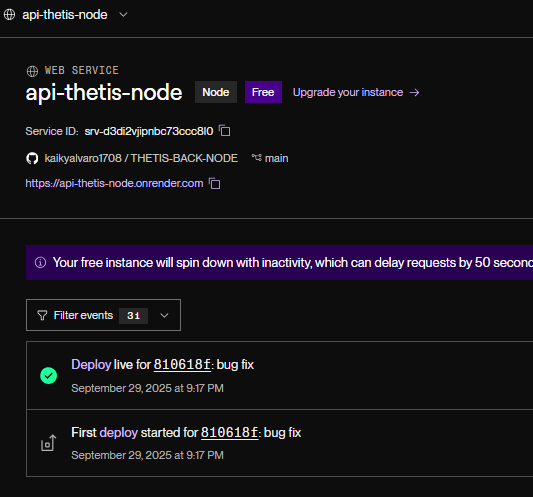
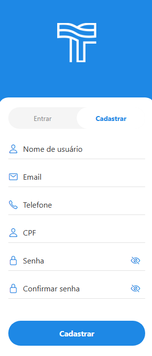
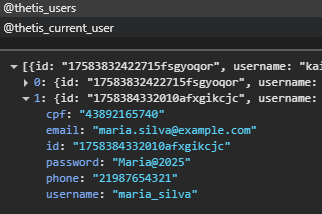
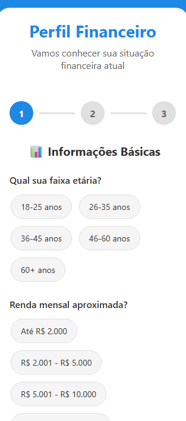
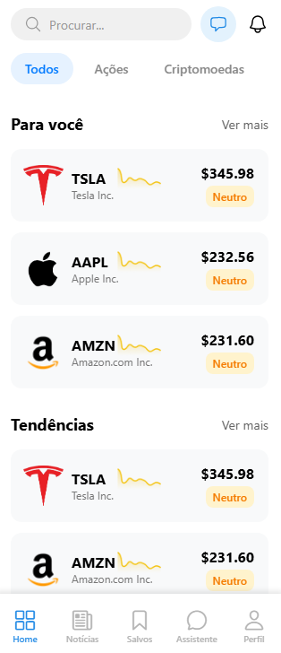
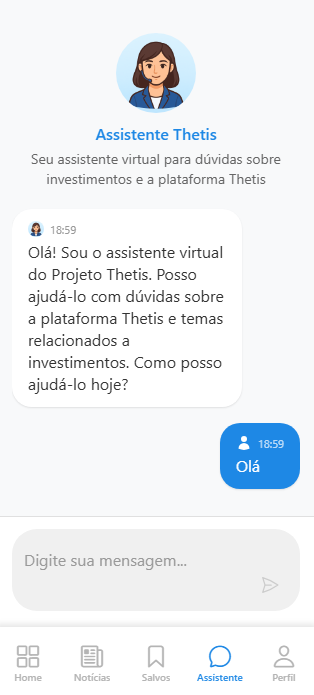
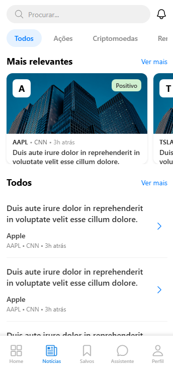
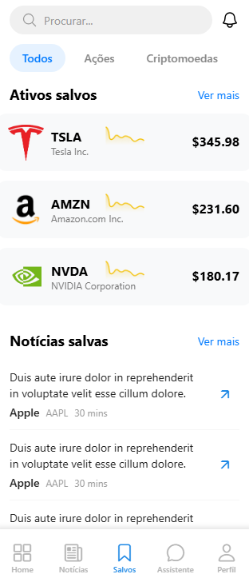
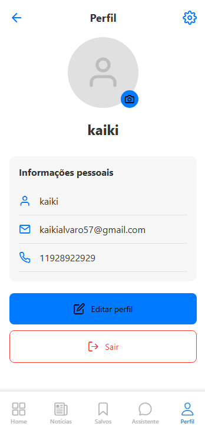

# Thetis 🌊

Inspirado na deusa grega Thetis, protetora dos mares e conhecedora dos destinos, nosso app navega pelas águas do mercado financeiro para revelar as melhores oportunidades de investimento.

## 👥 Integrantes do Grupo

| Nome                           | RM     |
| ------------------------------ | ------ |
| Kaiky Alvaro Miranda           | 98118  |
| Lucas Rodrigues da Silva       | 98344  |
| Juan Pinheiro de França        | 552202 |
| Matheus Gusmão Aragão          | 550826 |
| Júlia Marques Mendes das Neves | 98680  |

## Link do Figma

[Acesse o protótipo no Figma](https://www.figma.com/design/oGfWj2j5WEkm9pEF7GFH7I/Challenge-2025?node-id=137-431&t=YV3Ia2b5E7Stu59J-1)

## Sobre o Projeto

Thetis é um aplicativo mobile inteligente desenvolvido em React Native que utiliza inteligência artificial para oferecer insights precisos sobre o mercado financeiro. Com uma interface moderna e intuitiva, o app ajuda investidores de todos os níveis a tomar decisões mais informadas.

## Backend ( AVISO )

O backend do projeto está hospedado na plataforma Render.

o Render entra em modo de hibernação automaticamente após 15 minutos de inatividade, ou seja, se nenhuma requisição for feita nesse período, o servidor será temporariamente desligado.
Ao fazer uma nova requisição, ele será reiniciado automaticamente (isso pode levar alguns segundos/minutos).



## Environment (Aviso)

Para o funcionamento correto do projeto, é necessário criar um arquivo .env na raiz do projeto com as seguintes variáveis:

```env
BASE_URL=https://api-thetis-node.onrender.com/api
BASE_URL_PROFILE_INVESTOR=https://api-thetis-node.onrender.com/profile
AUTH_URL=https://api-thetis-node.onrender.com/auth
CHATBOT_URL=https://api-thetis-node.onrender.com/chatbot
AWS_RECOMMENDATIONS_URL=https://k3uq0zpiy0.execute-api.us-east-1.amazonaws.com/prod/recommendations
AWS_TOP_STOCKS_URL=https://6lgshugcuj.execute-api.us-east-1.amazonaws.com/prod/analyze
```

## Funcionalidades Principais

### Cadastro e Login



#### Exemplo de usuário para cadastro:

```json
{
  "username": "maria_silva",
  "email": "maria.silva@example.com",
  "phone": "21987654321",
  "cpf": "43892165740",
  "password": "Maria@2025"
}
```



### Perfil do investidor



### Dashboard Principal (Home)

- **Portfólio Personalizado**: Acompanhe seus investimentos em tempo real
- **Tendências do Mercado**: Ações em alta e oportunidades emergentes
- **Visão Geral**: Panorama completo do mercado financeiro
- **Busca Inteligente**: Encontre rapidamente ações e ativos



### Assistente Virtual (ChatBot) !AVISO

- **IA Especializada**: Chatbot treinado em temas de investimento
- **Suporte**: Tire dúvidas sobre a plataforma Thetis
- **Interface Conversacional**: Experiência natural e intuitiva




### Central de Notícias (Newspaper)

- **Notícias Relevantes**: Informações que impactam seus investimentos
- **Atualizações em Tempo Real**: Mantenha-se sempre informado
- **Categorização Inteligente**: Notícias organizadas por setor e importância



### Favoritos (Bookmark)

- **Lista Personalizada**: Salve ações e conteúdos de seu interesse
- **Organização Inteligente**: Categorias automáticas e manuais
- **Acesso Rápido**: Encontre rapidamente seus ativos favoritos



### Perfil do Usuário

- **Gestão de Conta**: Informações pessoais e preferências



## Tecnologias Utilizadas

### Frontend Mobile

- **React Native**: Framework principal para desenvolvimento mobile
- **TypeScript**: Tipagem estática para maior confiabilidade
- **React Navigation**: Navegação fluida entre telas
- **Styled Components**: Estilização dinâmica e tematização
- **Heroicons**: Ícones modernos e consistentes

### Funcionalidades Técnicas

- **Context API**: Gerenciamento de estado global
- **AsyncStorage**: Persistência local de dados
- **Safe Area Context**: Adaptação para diferentes dispositivos
- **Keyboard Avoiding**: Interface responsiva ao teclado

## Instalação e Configuração

### Pré-requisitos

````bash
# Node.js (versão 16 ou superior)
node --version

# React Native CLI
npm install -g react-native-cli


### Instalação

```bash
# Clone o repositório
git clone

# Entre no diretório
cd thetis-app

# Instale as dependências
npm install

### Execução

```bash
# Android
npx expo start
a

# web
npx expo start
w

````
